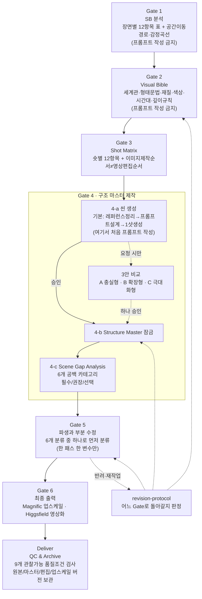

# 전체 워크플로우 다이어그램

프로젝트 고유명사 없이 6단계 게이트 흐름만 표시한다. 실제 프로젝트의 진행 상태는 해당 프로젝트 폴더의 `00-note.md` 요약 섹션에 기록한다.

## 게이트별 정지 규칙

- Gate 1, 2는 이미지 프롬프트 작성 자체를 금지한다.
- Gate 4-a에서 처음으로 프롬프트를 쓰되, 캐릭터·FX 없는 무인 배경까지만이다. 기본은 1샷이고, 3안 비교는 사용자가 명시적으로 요청할 때만 한다.
- Gate 4-b(Structure Master 잠금)는 반드시 Gate 4-a에서 하나의 안이 승인된 뒤에만 시작한다.
- Gate 4-c(Scene Gap Analysis)는 Gate 4-b 이후에만 시작하고, 이 단계에서는 추가 씬의 목록과 우선순위만 승인받는다. 장문 프롬프트는 Gate 5에서 쓴다.
- Gate 5는 요청마다 먼저 6개 분류 중 하나로 분류하고, 그 한 가지 작업만 처리한다.
- 매 응답은 현재 Gate 번호와 목적을 한 줄로 표시하고 시작한다.
- 각 게이트·하위 단계는 사용자 승인이 있어야 다음으로 넘어간다. 화살표는 "승인 후 이동"을 뜻하지 자동 진행을 뜻하지 않는다.
